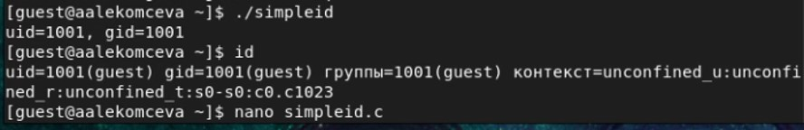
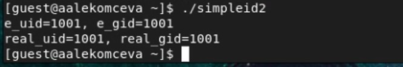
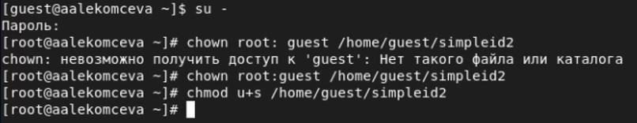
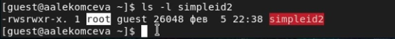
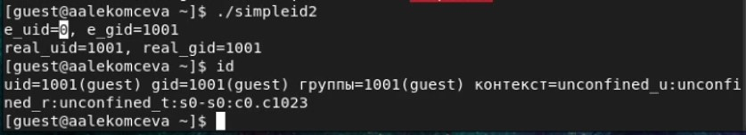
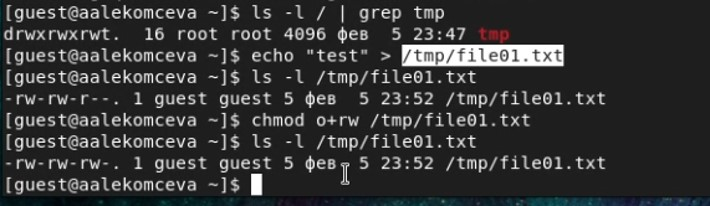
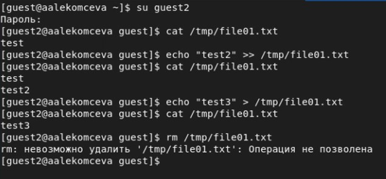

---
# Front matter
lang: ru-RU
title: 'Отчёт'
subtitle: 'по лабораторной работе 5'
author: 'Лекомцева Алёна'

# Formatting
toc-title: 'Содержание'
toc: true # Table of contents
toc_depth: 2
lof: true # List of figures
lot: true # List of tables
fontsize: 12pt
linestretch: 1.5
papersize: a4paper
documentclass: scrreprt
polyglossia-lang: russian
polyglossia-otherlangs: english
mainfont: PT Serif
romanfont: PT Serif
sansfont: PT Sans
monofont: PT Mono
mainfontoptions: Ligatures=TeX
romanfontoptions: Ligatures=TeX
sansfontoptions: Ligatures=TeX,Scale=MatchLowercase
monofontoptions: Scale=MatchLowercase
indent: true
pdf-engine: lualatex
header-includes:
  - \linepenalty=10 # the penalty added to the badness of each line within a paragraph (no associated penalty node) Increasing the value makes tex try to have fewer lines in the paragraph.
  - \interlinepenalty=0 # value of the penalty (node) added after each line of a paragraph.
  - \hyphenpenalty=50 # the penalty for line breaking at an automatically inserted hyphen
  - \exhyphenpenalty=50 # the penalty for line breaking at an explicit hyphen
  - \binoppenalty=700 # the penalty for breaking a line at a binary operator
  - \relpenalty=500 # the penalty for breaking a line at a relation
  - \clubpenalty=150 # extra penalty for breaking after first line of a paragraph
  - \widowpenalty=150 # extra penalty for breaking before last line of a paragraph
  - \displaywidowpenalty=50 # extra penalty for breaking before last line before a display math
  - \brokenpenalty=100 # extra penalty for page breaking after a hyphenated line
  - \predisplaypenalty=10000 # penalty for breaking before a display
  - \postdisplaypenalty=0 # penalty for breaking after a display
  - \floatingpenalty = 20000 # penalty for splitting an insertion (can only be split footnote in standard LaTeX)
  - \raggedbottom # or \flushbottom
  - \usepackage{float} # keep figures where there are in the text
  - \floatplacement{figure}{H} # keep figures where there are in the text
---

# Цель работы

Изучение механизмов изменения идентификаторов, применения SetUID- и Sticky-битов. Получение практических навыков работы в кон- соли с дополнительными атрибутами. Рассмотрение работы механизма смены идентификатора процессов пользователей, а также влияние бита Sticky на запись и удаление файлов.

# Задание

Лабораторная работа подразумевает создание программ и использование Sticky-бита.

# Выполнение лабораторной работы

1. Войдем в систему от имени пользователя guest. (рис.1).

2. Создаем программу simpleid.c и компилируем ее. (рис.1).

   { #fig:001 width=60% }

3. Выполним программы simpleid и id. Сравним полученныt нами результаты. Они совпадают. (рис.2).

   { #fig:002 width=60% }

4. Усложним программу, добавив вывод действительных идентификаторов. Получившуюся программу назовем simpleid2.c. (рис.3).

   { #fig:003 width=60% }

5. Скомпилируем и запустим simpleid2.c. (рис.4).

   { #fig:004 width=60% }

6. От имени суперпользователя выполним команды: chown root:guest /home/guest/simpleid2 и chmod u+s /home/guest/simpleid2. Первая меняет владельца файла, а вторая устанавливает SetUID-бит. (рис.5).

   { #fig:005 width=60% }

7. Выполним проверку правильности установки новых атрибутов и смены владельца файла simpleid2 (рис.6).

   { #fig:006 width=60% }

8. Запустим simpleid2 и id и сравним результат. Результаты одинаковы. (рис.7).

   { #fig:007 width=60% }

9. Проделаем тоже самое относительно SetGID-бита (рис.8).

   { #fig:008 width=60% }

10. Создаем программу readfile.c и компилируем ее. (рис.9).

   { #fig:009 width=60% }

11. Сменим владельца у файла readfile.c и изменим права так, чтобы только суперпользователь (root) мог прочитать его, a guest не мог. Проверим, что пользователь guest не может прочитать файл readfile.c. (рис.10).

   { #fig:010 width=60% }

12. Сменим у программы readfile владельца и установим SetUID-бит. Проверим, может ли программа readfile прочитать файл readfile.c. Может. (рис.11).

   { #fig:011 width=60% }

13. Проверим, может ли программа readfile прочитать файл /etc/shadow. Может. (рис.12).

   { #fig:012 width=60% }

14. Выясним, установлен ли атрибут Sticky на директории /tmp/. Уствновлен.
От имени пользователя guest создадим файл file01.txt в директории /tmp со словом test. Просмотрим атрибуты у только что созданного файла и разрешим чтение и запись для категории пользователей «все остальные». Проверим правильность выполнения команд. (рис.13).

   { #fig:013 width=60% }

15. От пользователя guest2 (не являющегося владельцем) попробуем прочитать, дозаписать, перезаписать и удалить файл /tmp/file01.txt. Удалось выполнить все команды, кроме удаления файла. (рис.14).

   { #fig:014 width=60% }

16. Повысим свои права до суперпользователя командой su - и выполним после этого команду, снимающую атрибут t (Sticky-бит) с директории /tmp. Повторим предыдущие шаги от пользователя guest2. Нам удалось удалить файл от имени пользователя, не являющегося его владельцем. (рис.15).

    { #fig:015 width=60% }

# Выводы

Я изучила механизмы изменения идентификаторов, применения SetUID- и Sticky-битов. Получила практические навыки работы в консоли с дополнительными атрибутами. Рассмотрела работы механизма смены идентификатора процессов пользователей, а также влияние бита Sticky на запись и удаление файлов.
